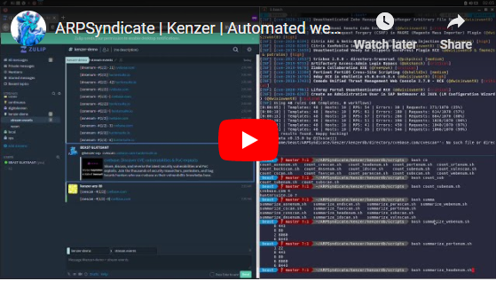
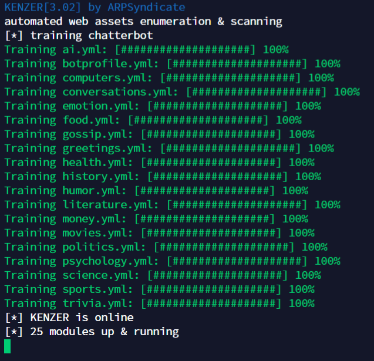
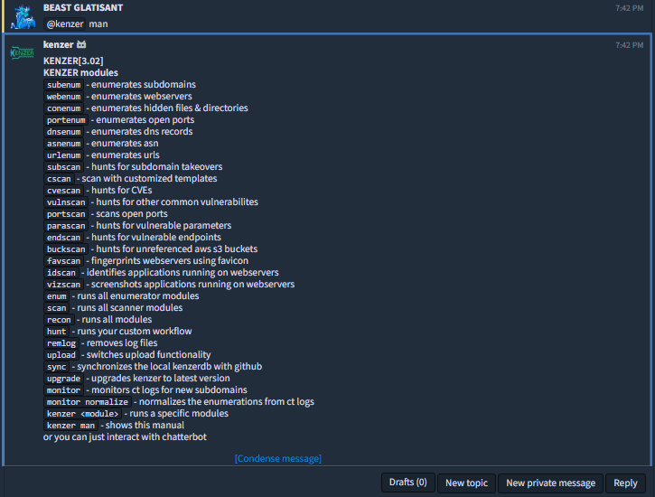
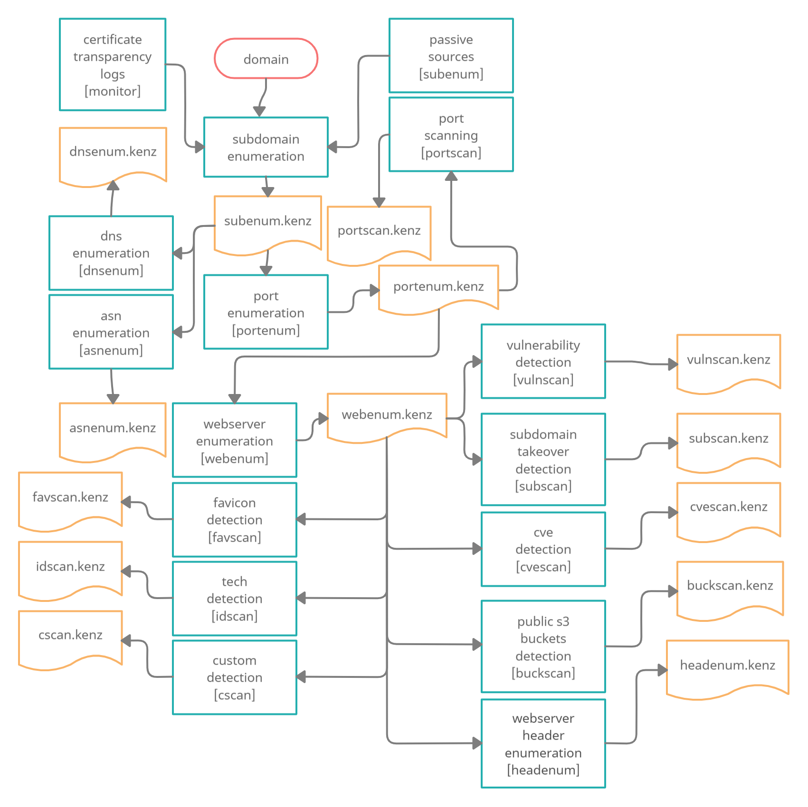

# KENZER | Automated web assets enumeration & scanning

## Mentions

[A Conceptual Introduction to Automating Bug Bounties](https://g147.medium.com/a-conceptual-introduction-to-automating-bug-bounties-ft-arpsyndicate-yeswehack-scanfactory-f2468f345d7) 

## Demo

## Screenshots

## Instructions for running

0. Run `git clone https://github.com/ARPSyndicate/kenzer /root/kenzer && cd /root/kenzer` **(preferred)** 
1. Create an account on [Zulip](https://zulipchat.com) 
2. Navigate to `Settings > Your Bots > Add a new bot` 
3. Create a new generic bot named `kenzer` 
4. Add all the configurations in `configs/kenzer.conf` 
5. Install/Run using -  
   - `./install.sh -b` [if you need `kenzer-compatible` binaries to be installed] **(preferred)** 
   - `./install.sh` [if you do not need `kenzer-compatible` binaries to be installed] 
   - `./run.sh` [if you do not need installation at all] 
   - `./service.sh` [initialize it as a service post-installation] **(preferred)** 
   - `bash swap.sh` [in case you are facing memory issues]
6. Interact with `kenzer` using Zulip client, by adding bot to a stream or via DM. 
7. Test `@**kenzer** man` as Zulip input to display available commands. 
8. All the commands can be used by mentioning the chatbot using the prefix `@**kenzer**` (name of your chatbot). 

## Built-in Modules

> - `blacklist <target>,<regex>` - initializes & removes blacklisted targets
> - `whitelist <target>,<regex>` - initializes & keeps only whitelisted targets
> - `program <target>,<link>` - initializes the program to which target belongs
> - `subenum[-<mode>[active/passive]] <target>` - enumerates subdomains
> - `repenum <target>` - enumerates reputation of subdomains
> - `repoenum <target>` - enumerates github repositories
> - `portenum[-<mode>[100/1000/full/fast]] <target>` - enumerates open ports
> - `servenum <target>` - enumerates services
> - `webenum <target>` - enumerates webservers
> - `headenum <target>` - enumerates additional info from webservers
> - `urlheadenum <target>` - enumerates additional info from urls
> - `asnenum <target>` - enumerates asn records
> - `dnsenum <target>` - enumerates dns records
> - `conenum <target>` - enumerates hidden files & directories
> - `urlenum[-<mode>[active/passive]] <target>` - enumerates urls
> - `socenum <target>` - enumerates social media accounts
> - `subscan <target>` - hunts for subdomain takeovers
> - `reposcan <target>` - scans github repositories for api key leaks
> - `cscan[-<severity>[critical/high/medium/low/info]] <target>` - scan with customized templates
> - `cvescan[-<severity>[critical/high/medium/low/info]] <target>` - hunts for CVEs
> - `vulnscan[-<severity>[critical/high/medium/low/info]] <target>` - hunts for other common vulnerabilites
> - `endscan[-<severity>[critical/high/medium/low/info]] <target>` - hunts for vulnerablities in custom endpoints
> - `idscan[-<severity>[critical/high/medium/low/info]] <target>` - identifies applications running on webservers
> - `portscan <target>` - scans open ports (nmap)(slow)
> - `shodscan <target>` - scans open ports (shodan)(fast)
> - `buckscan <target>` - hunts for unreferenced aws s3 buckets
> - `favscan <target>` - fingerprints webservers using favicon
> - `vizscan <target>` - screenshots applications running on webservers
> - `enum <target>` - runs all enumerator modules
> - `scan <target>` - runs all scanner modules
> - `recon <target>` - runs all modules
> - `hunt <target>` - runs your custom workflow
> - `upload` - switches upload functionality
> - `upgrade` - upgrades kenzer to latest version
> - `monitor <target>` - monitors ct logs for new subdomains
> - `monitor normalize` - normalizes the enumerations from ct logs
> - `monitor db` - monitors ct logs for domains in summary/domain.txt
> - `monitor autohunt <frequency(default=5)>` - starts automated hunt while monitoring
> - `sync` - synchronizes the local kenzerdb with github
> - `freaker <module> [<target>]` - runs freaker module
> - `kenzer <module>` - runs a specific modules
> - `kenzer man` - shows this manual

## The Beginner's Workflow

Although few more modules are available & much more is going to be released in the course of time which can advance this workflow, yet this one is enough to get started with & listed below are few of its successful hunts.  

**COMPATIBILITY TESTED ON DEBIAN(x64) ONLY** 
**RIGGED WITH LOGIC ISSUES** 
**FEEL FREE TO SUBMIT PULL REQUESTS**
